Harmonia de cores

- Circulo cromatico
Utilizado para harmonizar cores

- Cores primarias (Amarelo, vermelho e azul)
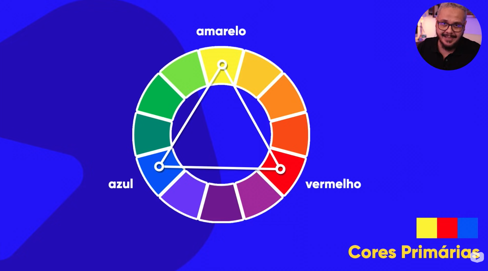

- Cores secundarias (Laranja, violeta e verde)
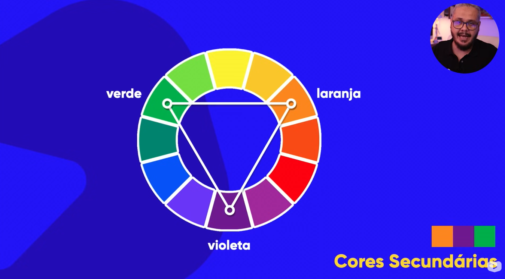

- Cores terciarias (Junção de entre uma cor primaria e uma secundaria)
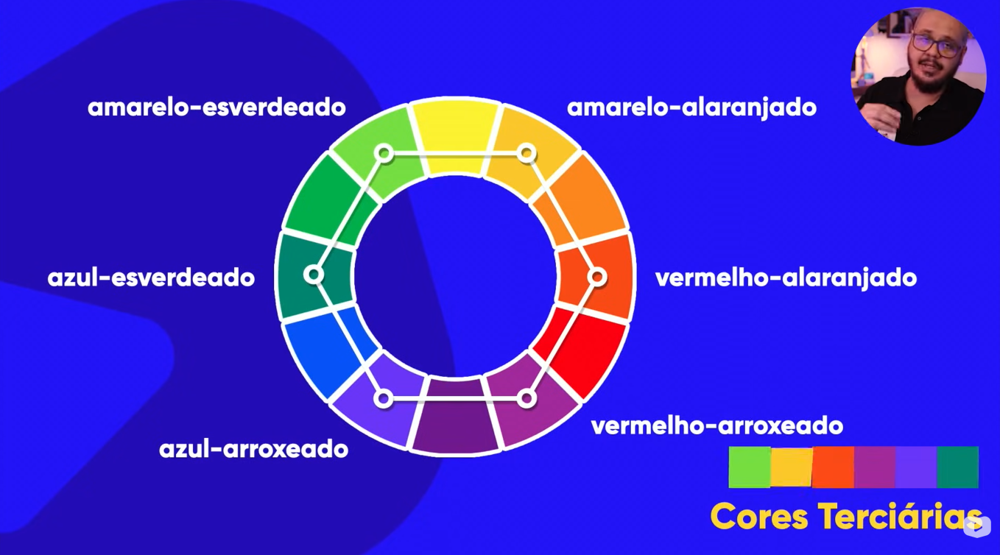

- Temperatura das cores
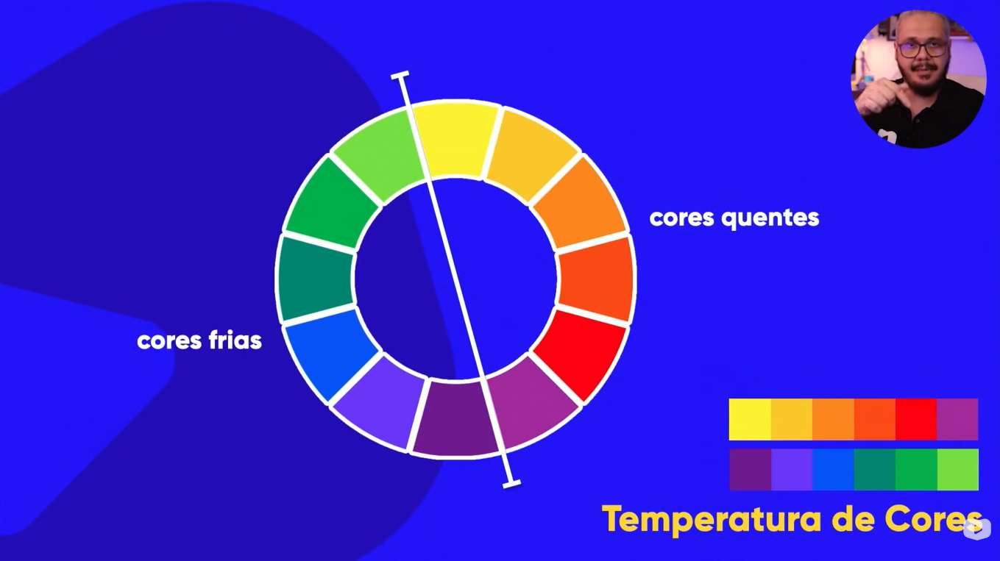

- Cores complementares (Imediatamente opostas a outra)
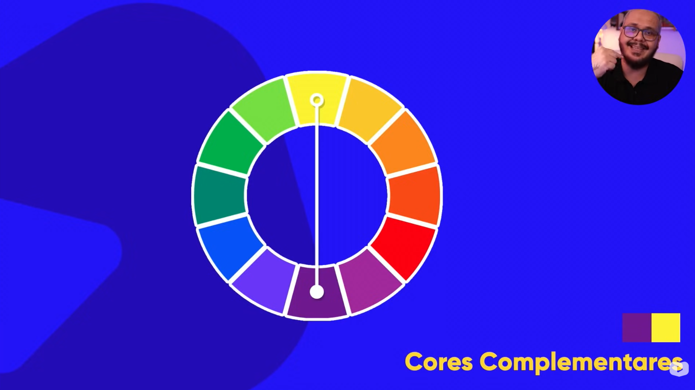

- Cores análogas (3 Cores imediatamente proximas)
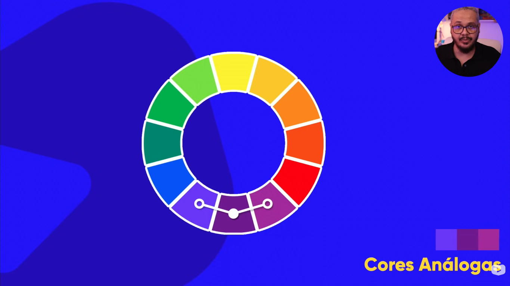

- Cores análogas e uma complementar
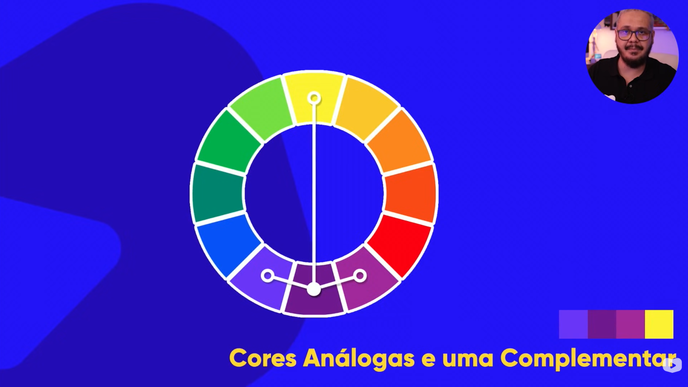

- Cores análogas relacionadas (Duas cores imediatamente proximas e pula uma para dar contraste)
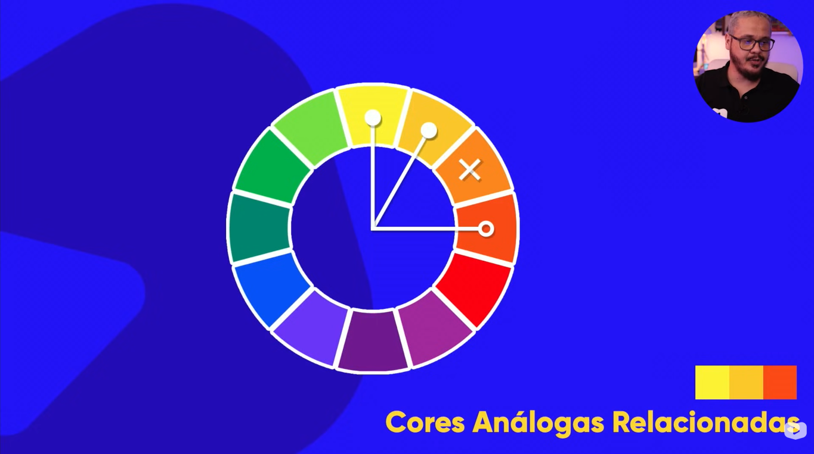
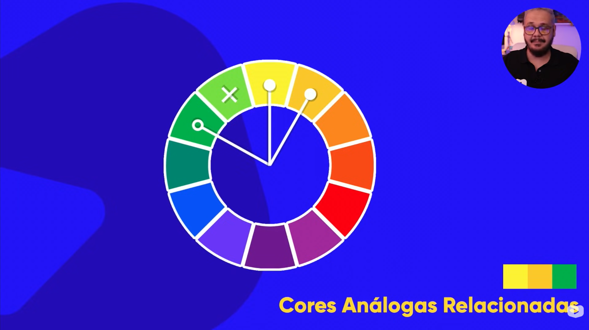

- Cores intercaladas (Escolhe uma e pula uma)
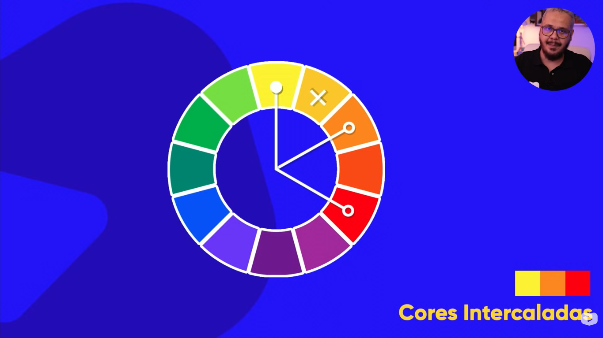

- Cores triádicas (Escolhe uma e pula 3 cores)
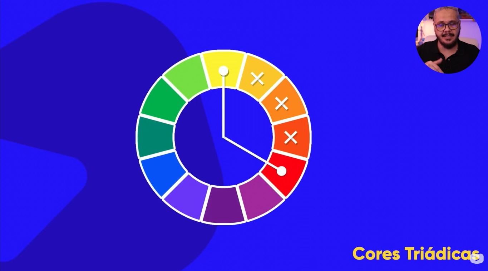
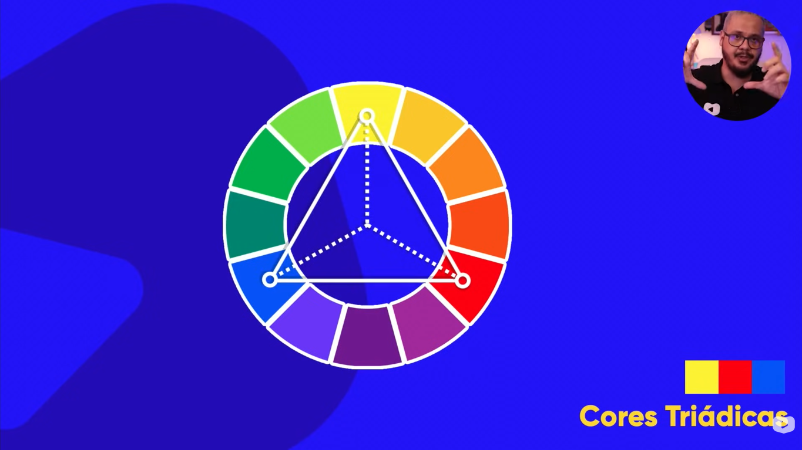

- Cores quadráticas(Escolhe uma e pula 2)
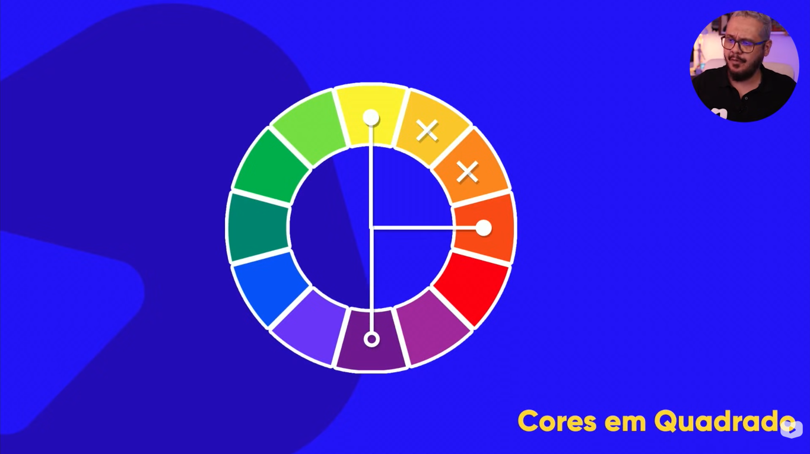
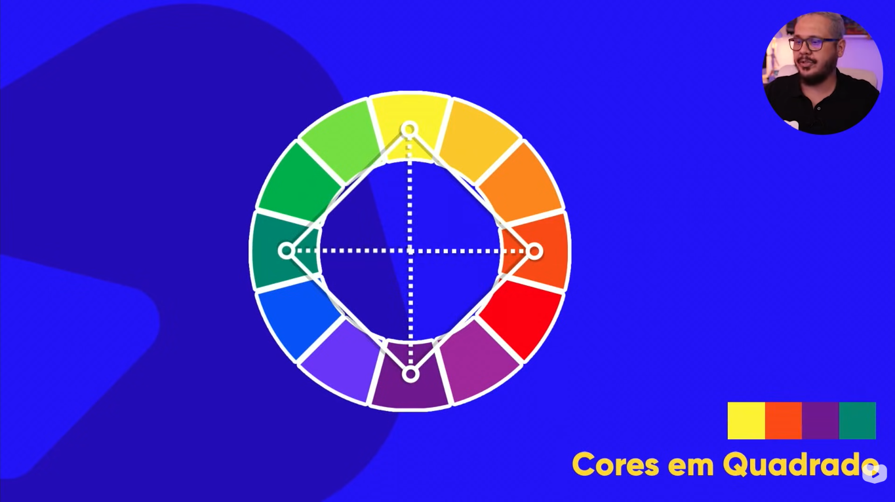

- Cores tetrádicas (Escolhe uma cor e sua complementar e outra cor e sua complementar)
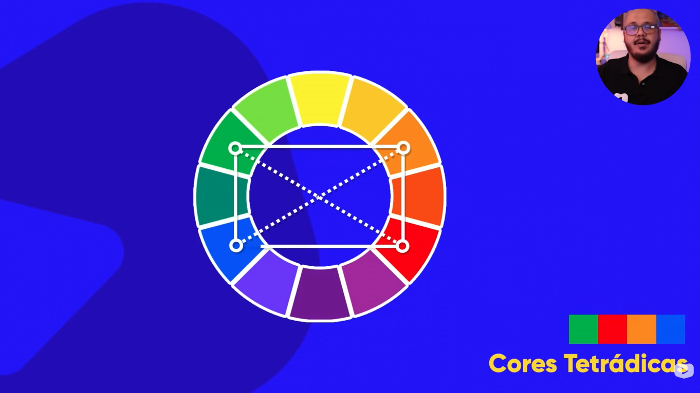

- Monocromia (Escolhe uma cor e alterar a saturação e a luminosidade)
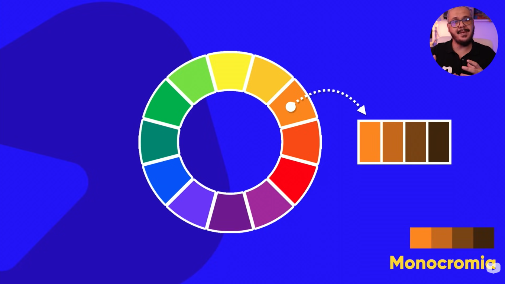