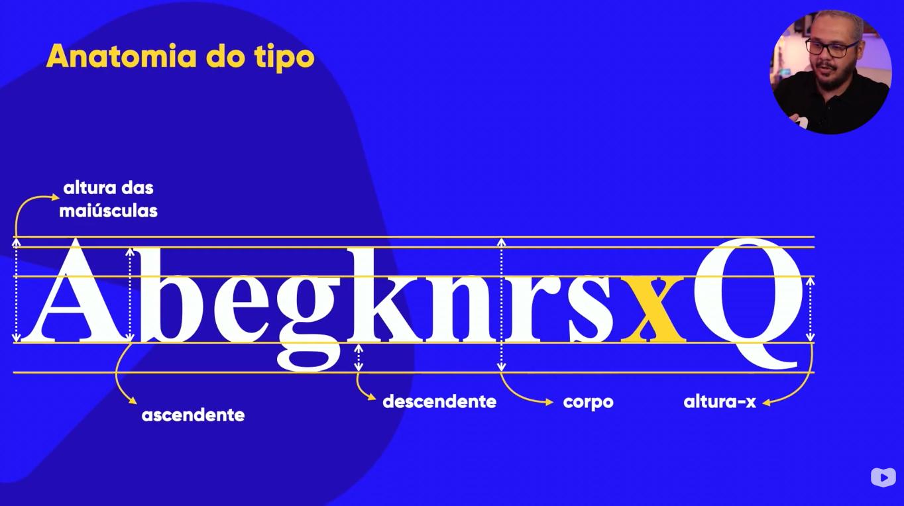
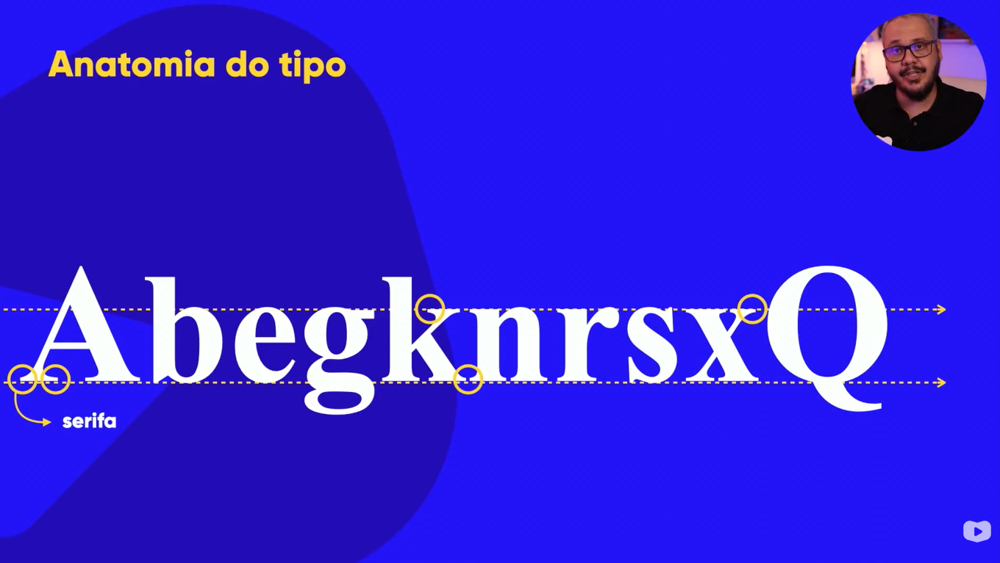
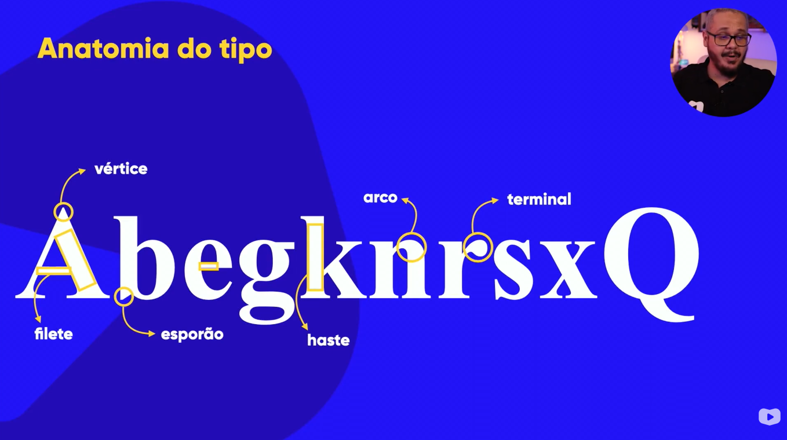
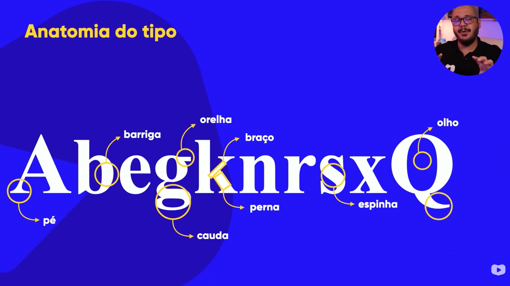
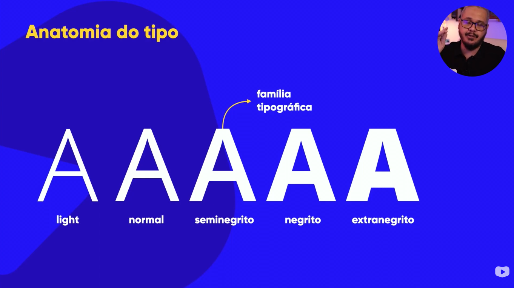
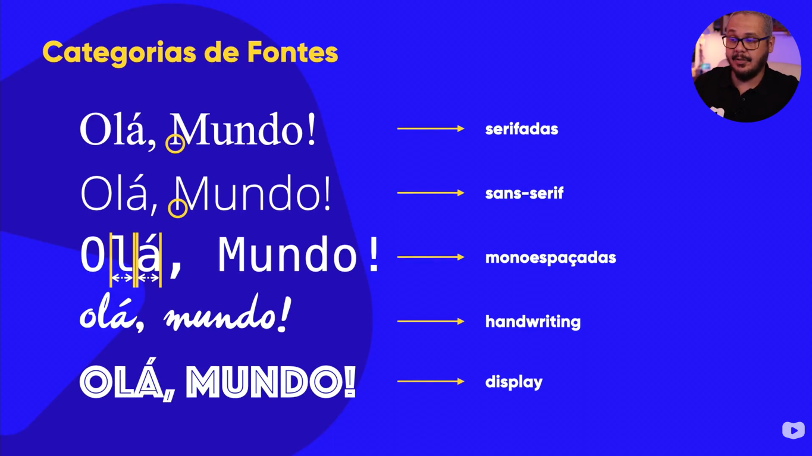

- Estudo dos tipos (letras impressas)

- A forma das fontes passa um sentimento, uma impressão

- Anatomia do tipo
  A letra x é o ponto de partida para desenvolvimento das fontes, todas letras minusculas seguem a altura da letra x
  

- As serifas ajudam ao nosso cerebro traçar um alinhamento das letras para facilitar a leitura
  

- Componentes anatomicos
  
  

- Familia tipografica
  

- Categorias de fontes
  
