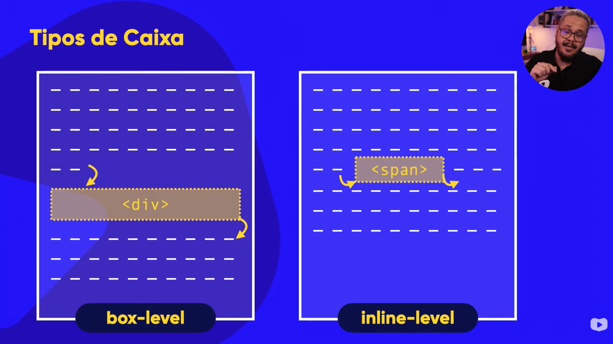
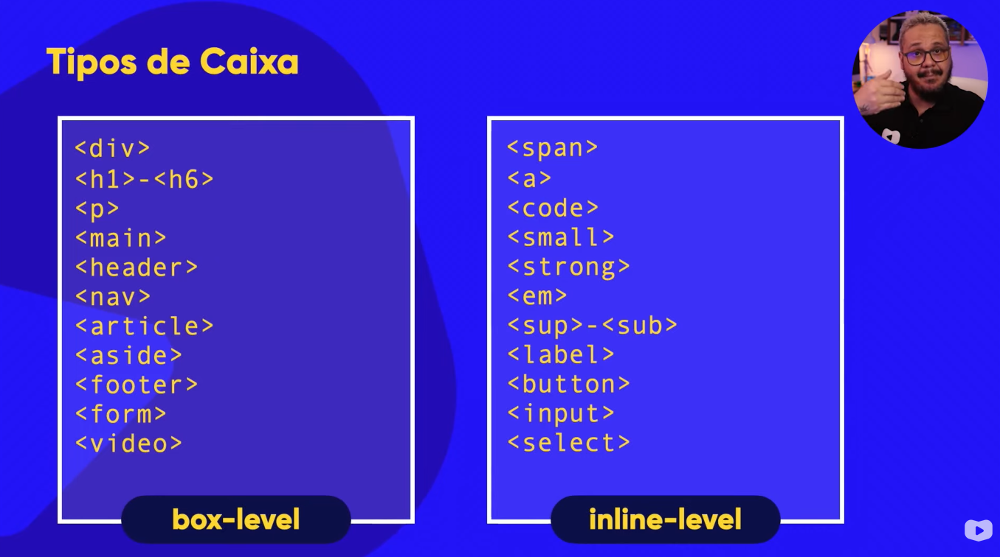

Todo elemento tem uma altura (height) e largura (width)

Padding é o preenchimento entre o elemento e a borda

Margin é um espaçamento da borda para fora

Pode criar também um contorno fora da borda

Tipos de caixa

Exemplos

Exemplos
